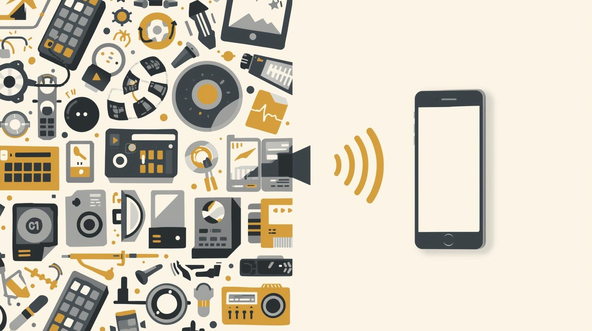
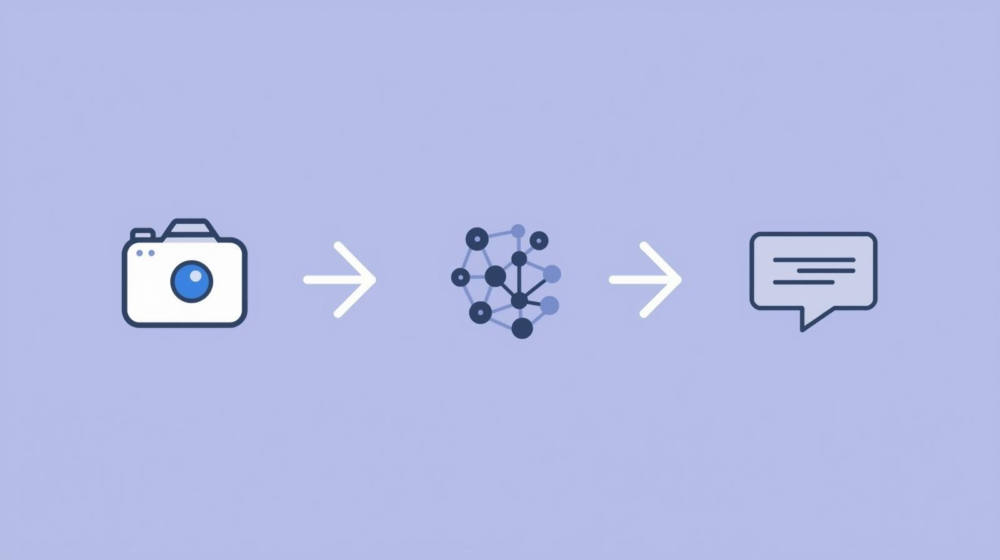

# 👁️ SenseAble AI  
### AI Assistant for the Visually Impaired  

SenseAble AI is a voice-based assistive solution designed to help visually impaired individuals perform everyday tasks independently.  
It focuses on using artificial intelligence responsibly to improve accessibility, confidence, and dignity in daily life.

---

## 🌍 The Everyday Problem

Many simple tasks that sighted people take for granted—such as reading medicine labels, understanding signboards, or identifying nearby objects—can be challenging for visually impaired individuals.  

These tasks often require human assistance, leading to daily dependency and reduced independence.  
Over time, this affects confidence and quality of life.

SenseAble AI addresses this **real-world, everyday problem**, not an abstract or niche use case.

---

## ❓ Why Existing Solutions Fall Short

Current assistive solutions often:
- Work only for a single task  
- Require manual interaction or complex interfaces  
- Depend on special or expensive hardware  
- Do not provide real-time, continuous assistance  

Many tools solve parts of the problem—but not the **entire daily experience**.

---

## 💡 Our Solution — SenseAble AI

SenseAble AI turns a smartphone into a **voice-guided digital assistant**.

Using the phone’s camera and microphone, it:
- Reads printed text aloud (labels, documents, signboards)
- Identifies common objects in the user’s surroundings
- Operates completely hands-free using voice interaction

The solution is designed to work on devices people already own, making it practical and accessible.

---

## 🧩 What Makes SenseAble AI Different

- **Voice-first design** — no screen dependency  
- **Unified experience** — multiple assistive features in one solution  
- **Everyday usability** — designed for real-world scenarios  
- **Affordable and scalable** — no special hardware required  
- **Ethical AI approach** — focused on assistance, not surveillance  

The goal is not advanced technology for its own sake, but meaningful impact.

---

## ⚙️ How It Works (High-Level)

1. The user captures an image using the smartphone camera  
2. AI-based text and visual understanding processes the image  
3. Relevant information is extracted and cleaned  
4. The system converts information into clear, natural speech  
5. Audio feedback is delivered to the user in real time  

This approach ensures clarity, reliability, and usability in everyday environments.

---

## 🛠️ Development Approach

SenseAble AI is being built using:
- Computer vision for image understanding  
- Optical Character Recognition (OCR) for reading printed text  
- Text-to-Speech for audio feedback  
- Post-processing techniques to ensure human-friendly speech  
- Open-source tools and responsible AI practices  

This repository represents an evolving prototype developed during the  
**Netweb AI for Public Good Hackathon**.

---

## 🌱 Social Impact

SenseAble AI aims to:
- Reduce daily dependency  
- Increase independence and confidence  
- Make assistive technology more accessible  
- Encourage inclusive and ethical AI design  

The solution is designed **for everyone**, not just a limited user group.

---

## 🚀 Future Scope

- Improved real-time object awareness  
- Multilingual voice support  
- Offline functionality  
- Context-aware assistance  
- Broader accessibility applications  

---

## 🤝 Team

**Team Name:** SenseAble AI  

Built with the belief that technology should empower people, not replace them.

---

## 📌 Note

This project is currently at the ideation and prototyping stage.  
The repository will be updated with code, demos, and documentation as development progresses.
